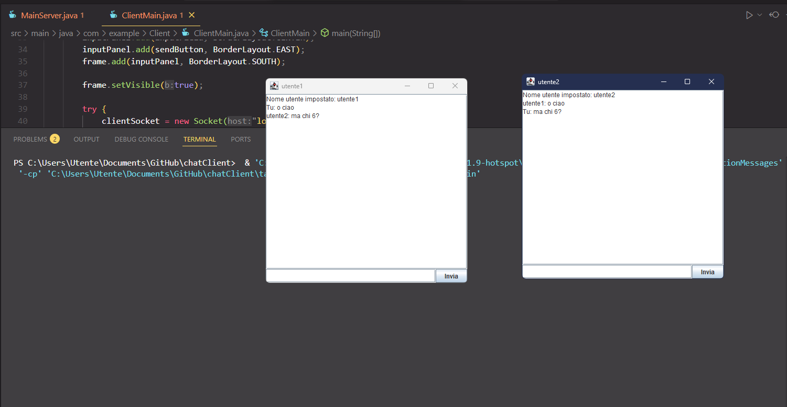

# 🗨️ ChatClient


Un semplice client di chat basato su **Java**, utilizzando **socket TCP** e **thread** per la comunicazione in tempo reale tra più utenti. Perfetto per esplorare il networking in Java! 🚀 Ora con **interfaccia grafica (GUI)** grazie a **JFrame**! 🎨

---

## ✨ Funzionalità
✅ Connessione a un server di chat
✅ Invio e ricezione di messaggi in tempo reale
✅ Supporto per più utenti
✅ Implementazione basata su **Java Threads** per la gestione delle connessioni
✅ **Interfaccia grafica con JFrame** per un'esperienza utente migliorata

---

## ⚙️ Installazione

1. **Clona il repository**
```bash
 git clone https://github.com/MrErmita/chatClient.git
 cd chatClient
```
2. **Compila ed esegui il server**
```bash
javac -d bin src/com/example/Server/MainServer.java
java -cp bin com.example.Server.MainServer
```
3. **Compila ed esegui il client**
```bash
javac -d bin src/com/example/Client/MainClient.java
java -cp bin com.example.Client.MainClient
```

---

## 📡 Come Funziona
Il server utilizza un **ServerSocket** per accettare connessioni dai client. Ogni client viene gestito tramite un **Thread separato**, garantendo un'efficace gestione delle comunicazioni in parallelo.

Esempio di codice per il server:
```java
ServerSocket serverSocket = new ServerSocket(5500);
while (true) {
    Socket clientSocket = serverSocket.accept();
    new Thread(new ClientHandler(clientSocket)).start();
}
```

Ora il client include un'interfaccia grafica basata su **JFrame**, migliorando la facilità d'uso:
```java
JFrame frame = new JFrame("Chat Client");
JTextArea chatArea = new JTextArea();
JTextField messageField = new JTextField();
JButton sendButton = new JButton("Invia");
```

---

## 📷 Screenshot


---

## 🛠️ Tecnologie Utilizzate
- Java ☕
- Socket TCP/IP 📡
- Multi-threading 🧵
- **JFrame per la GUI** 🎨

---

## 🚀 Contribuire
Se vuoi migliorare il progetto:
1. Fai un **fork** del repo 🍴
2. Crea un **branch** con la tua feature `git checkout -b nuova-feature`
3. **Commit** le modifiche `git commit -m 'Aggiunta nuova feature'`
4. Fai un **push** `git push origin nuova-feature`
5. Apri una **Pull Request** 🚀

---

## 📜 Licenza
Questo progetto è distribuito sotto licenza MIT. 📄

---

## 📬 Contatti
📧 Email: [alessio.bragetti@gmail.com](mailto:alessio.bragetti@gmail.com)
🐙 GitHub: [MrErmita](https://github.com/MrErmita)

💡 **Star il repository se ti è piaciuto! ⭐**

